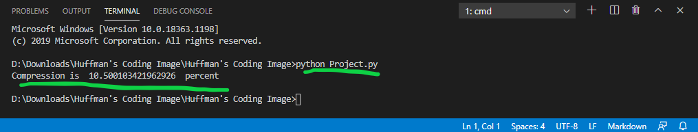
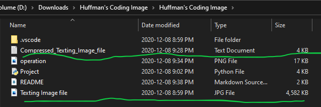

### Project Title
Implementation of Huffman Coding using Pyhton for Image file

### Explanation
The main usage of Huffman Coding is to change the size of an file (Audio, Video and Text) without making any changes to its data. after the huffman coding process the 2D image in line of codes for each pixel and also gives the efficiency of compression scheme.
As an image is to convert we have used the Numpy in our project which is an Python library used for working with arrays.
Imageio library is also used. Now this provides easy interface to read and write a wide range of data, including animated images, volumetric data and scientfic formats. It also requires Python 3.5+
The third library we have used is the queue library which is linear data structure. In which data is stored in First In First Out (FIFO) manner. With a queue the least recently added item is removed first.

### Project Layout
This project is completed using Pyhton 3.9.0 64-bit extension in Visual Studio Code

#### Testing / Running the program

1. Save / Clone the above repository
2. Now the repository consists of a sample text file named as "Texting Image file.jpeg".
3. Run the python code `Project_file.py` to compress the given text file. For eg. open terminal and run `python Project_file.py`

4. As you can see in the above image the file is compressed by 10.5%. This file is at the same location named as "Compressed_Texting_Image_file.txt".

If anyone wants to use any other image file, then makesure to change the name of file in Line 88 and run it using Python again.
